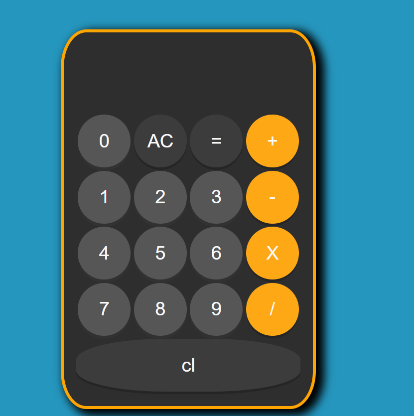

# 📱 iOS Style Calculator

  

A fully functional calculator web app inspired by the iconic Apple iOS design. Built with vanilla JavaScript to practice DOM manipulation and logic implementation.

**[🔴 LIVE DEMO]( https://sherikov.github.io/Calculator-ios-theme/)**

## 📸 Preview
 
> *Clean, minimalist interface replicating the look and feel of the iPhone calculator.*

## 🚀 Features

* **Authentic Design:** Visual style closely matches the iOS calculator (colors, fonts, active states).
* **Core Math Operations:** Addition, subtraction, multiplication, and division.
* **Responsive Button Interactions:** Active states and hover effects for better UX.
* **Clean Code Architecture:** Separation of concerns between HTML structure, CSS styling, and JS logic.

## 🛠️ Tech Stack

* **HTML5:** Semantic markup structure.
* **CSS3:** Flexbox/Grid for layout, CSS variables for theming.
* **JavaScript (ES6+):** Event handling and calculation logic.

## 💡 What I Learned

Building this project helped me improve my skills in:
* Handling user input and edge cases in calculation logic.
* Structuring JavaScript code for readability.
* Recreating complex UI designs using pure CSS.

---

## 📬 Contact

* **GitHub:** [Sherikov](https://github.com/Sherikov)

---
*Created for educational purposes.*
